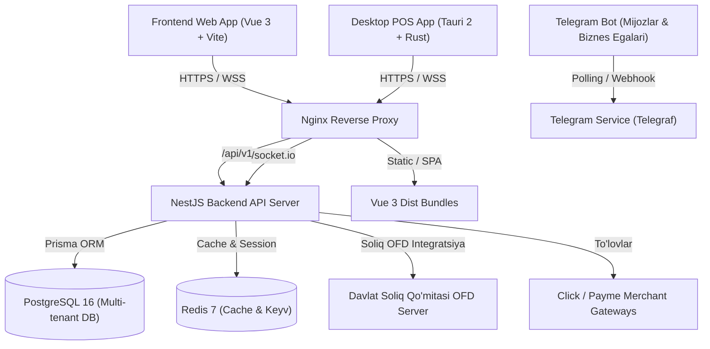

# 🏛️ boshqar.uz — Tizim Arxitekturasi va Muhandislik Qo'llanmasi (v2.0)

Ushbu hujjat **boshqar.uz** SaaS platformasining umumiy arxitekturasi, ma'lumotlar oqimi, modullar tuzilishi va xavfsizlik mexanizmlarini to'liq yoritadi. Maqsad — tizimning yagona dasturchiga bog'liqligini (Bus Factor) kamaytirish va yangi muhandislar uchun to'liq arxitektura xaritasini taqdim etish.

---

## 1. Umumiy Tizim Ekotizimi

---

## 2. Loyiha Monorepo Strukturasi

- **`ubms-backend/`** — NestJS 10 REST API backend serveri:
  - `src/modules/` — domen modullari (auth, billing, orders, products, inventory, customers, suppliers, shifts, finance, fiscal, analytics, telegram, super-admin).
  - `src/common/` — guards (`PermissionGuard`, `SubscriptionGuard`, `SuperAdminGuard`), decorators (`@CurrentBusinessId()`, `@CurrentUser()`), interceptors, filters.
  - `prisma/schema.prisma` — 32 ta ma'lumotlar jadvali va munosabatlari.
- **`ubms-frontend/`** — Vue 3 + Vite + Tailwind boshqaruv paneli va Universal POS tizimi:
  - `src/views/` — sahifalar (dashboard, pos, inventory, products, customers, suppliers, finance, billing, superadmin, settings, waiterview, kds).
  - `src/components/` — atomik va universal UI komponentlar.
  - `src/stores/` — Pinia global holat boshqaruvi (`auth`, `pos`, `shifts`, `theme`).
- **`ubms-desktop/`** — Tauri 2 (Rust) Windows/macOS Desktop ilovasi (80mm termal printer drayveri va offline kassa).
- **`ubms-telegram-bot/`** — Kunlik KPI xabarnomalar va savdo boti.
- **`ubms-shared-types/`** — Umumiy TypeScript interfeyslar va enumlar.

---

## 3. Multi-Tenant Izolyatsiya va Xavfsizlik

1. **Tenant Konteksti:**
   - Har bir foydalanuvchi bitta yoki bir nechta biznesga a'zo bo'lishi mumkin.
   - Autentifikatsiya JWT orqali amalga oshiriladi. `JwtStrategy` so'rovdagi biznesga foydalanuvchining a'zoligini DB orqali qat'iy tekshiradi va `req.businessId` ga faqat tasdiqlangan ID ni o'rnatadi.
2. **IDOR Himoyasi:**
   - Barcha DB operatsiyalari (`findMany`, `create`, `update`, `delete`) majburiy tarzda `where: { businessId }` qoidasiga bo'ysunadi.
   - `@CurrentBusinessId()` dekoratori orqali xom header manipulyatsiyalari bloklangan.
3. **Billing Narx Himoyasi:**
   - Obuna to'lov summalari (`amount`) har doim server tomonidan rasmiy tarif rejalari asosida hisoblanadi. Klient yuborgan ixtiyoriy summaga ishonilmaydi.

---

## 4. Ma'lumotlar Bazasi Modeli (32 ta Jadval)

- **Asosiy subyektlar:** `User`, `Business`, `Branch`, `BusinessUser`, `Role`, `Permission`, `RolePermission`.
- **Savdo & Mahsulotlar:** `Product`, `Category`, `Unit`, `Inventory`, `InventoryTransaction`, `Order`, `OrderItem`, `PaymentMethod`, `Payment`, `Refund`, `RefundItem`.
- **Restoran & Xizmatlar:** `Table`, `TableOrder`, `TableOrderItem`, `Appointment`, `Service`.
- **Moliya & Ta'minot:** `Customer`, `Supplier`, `SupplierPayment`, `SupplyInvoice`, `SupplyInvoiceItem`, `Expense`, `Revenue`, `Shift`.
- **Monetizatsiya & Tizim:** `Plan`, `Subscription`, `BillingRequest`, `PaymentRequisite`, `AuditLog`, `SystemSetting`.

---

## 5. Yangilanish va Kod Standartlari

- Har bir yangi endpoint uchun DTO va Swagger `@ApiOperation` majburiy.
- Pul oqimiga ta'sir qiluvchi har bir servis metodiga unit test (`.spec.ts`) yozilishi shart.
- Kod o'zgarishlari to'liq `npm test` va `npm run build` orqali tekshirilishi shart.
